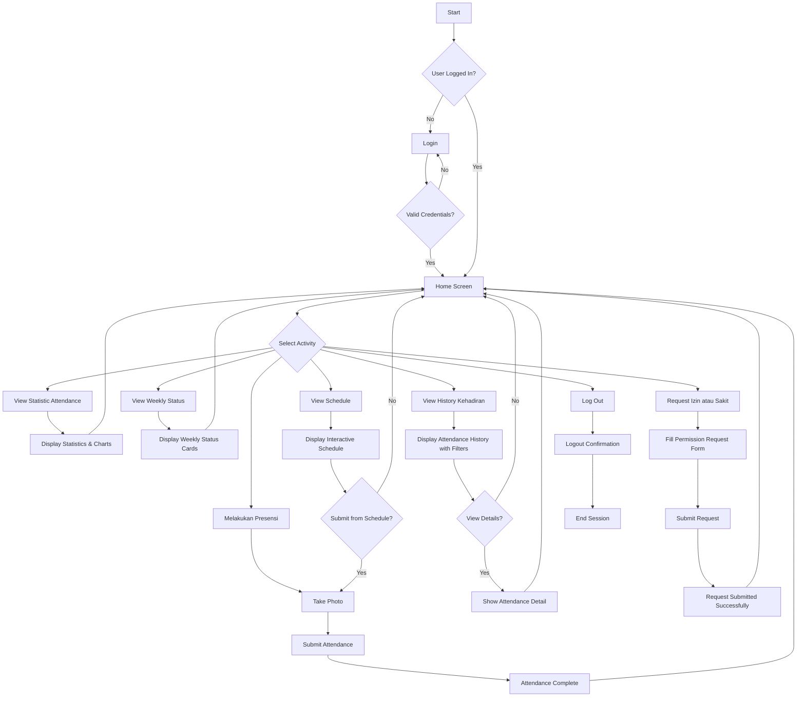

# Smart Attendance System

A comprehensive Android application built with Jetpack Compose for managing student attendance with modern UI/UX design and efficient navigation.

## Table of Contents
- [Features](#features)
- [Screenshots](#screenshots)
- [Architecture](#architecture)
- [Installation](#installation)
- [Usage](#usage)
- [Project Structure](#project-structure)
- [Technologies Used](#technologies-used)
- [Activity Diagram](#activity-diagram)
- [Contributing](#contributing)

## Features

### Authentication
- **Secure Login System**: Username and password validation with real-time feedback
- **Password Visibility Toggle**: Easy password input with show/hide functionality
- **Loading States**: Visual indicators during authentication process
- **Error Handling**: Clear feedback for invalid credentials

### Dashboard & Statistics
- **Attendance Overview**: Visual statistics with donut charts and progress indicators
- **Weekly Status**: Color-coded attendance tracking for each day
- **Quick Stats**: Present days, absent days, late arrivals, and attendance percentage
- **Modern Cards**: Clean Material Design 3 interface with shadow effects
- **Real-time Updates**: Dynamic data refresh and state management

### Schedule Management
- **Interactive Weekly View**: Horizontal scrolling schedule with smooth animations
- **Today's Highlight**: Special emphasis on current day's classes
- **Class Details**: Complete information including time, room, instructor, and course code
- **Status Indicators**: Visual badges for attendance status (Present, Absent, Late, Not Yet)
- **Quick Actions**: Direct attendance submission from schedule cards

### Attendance Submission
- **Camera Integration**: Photo capture for attendance verification
- **Real-time Processing**: Instant attendance recording with confirmation
- **Multiple States**: Support for Present, Absent, Late, and Pending status
- **Submission Feedback**: Comprehensive confirmation screens with details
- **Photo Preview**: Review captured photos before submission

### History & Analytics
- **Comprehensive List**: Chronological view of all attendance records
- **Advanced Filtering**: Filter by status, date range, and course
- **Detailed Records**: Complete information for each attendance entry
- **Status Colors**: Visual differentiation with color-coded status indicators
- **Interactive Cards**: Tap to view detailed attendance information

### Permission Management
- **Leave Applications**: Submit requests for sick leave or other permissions
- **Status Tracking**: Real-time monitoring of approval status
- **Rich Forms**: Detailed permission request forms with reason selection
- **History View**: Complete record of all permission requests
- **Approval Workflow**: Track requests from submission to approval

## Architecture

The application follows **Modern Android Architecture** principles:

- **Jetpack Compose**: Declarative UI framework for modern Android development
- **Material Design 3**: Latest Google design system with dynamic theming
- **Single Activity Pattern**: Navigation handled through Compose Navigation
- **State Management**: Reactive UI with Compose state and remember functions
- **Component Architecture**: Reusable UI components and modular design
- **Type-Safe Navigation**: Structured navigation with proper argument passing

## Installation

### Prerequisites
- **Android Studio**: Hedgehog | 2023.1.1 or later
- **Android SDK**: API level 24 (Android 7.0) or higher
- **Kotlin**: 1.9.0 or later
- **Gradle**: 8.0 or later

### Setup Steps
1. **Clone the repository:**
```bash
git clone https://github.com/yourusername/smart-attendance.git
cd smart-attendance
```

2. **Open in Android Studio:**
   - Launch Android Studio
   - Select "Open an Existing Project"
   - Navigate to the cloned directory

3. **Sync Project:**
   - Wait for Gradle sync to complete
   - Resolve any dependency issues

4. **Run the Application:**
   - Select a device/emulator
   - Click the "Run" button or press Shift+F10

## Usage

### Login Credentials
```
Username: a
Password: a
```

### Navigation Flow
1. **Login Screen**: Enter credentials to access the application
2. **Home Dashboard**: View attendance statistics and today's schedule
3. **Schedule**: Browse weekly schedule and submit attendance
4. **History**: View past attendance records with filtering options
5. **Permissions**: Manage leave requests and view approval status

### Key Features Usage
- **Attendance Submission**: Navigate to schedule → tap class card → take photo → submit
- **View Statistics**: Home screen displays comprehensive attendance analytics
- **Filter History**: Use filter options in history screen for specific records
- **Request Permission**: Access permission screen → fill form → submit request
- **Weekly Navigation**: Swipe horizontally on schedule to browse different days

## Project Structure

```
app/src/main/java/com/example/smartattendance/
├── MainActivity.kt                          # Main entry point with navigation setup
├── ui/
│   ├── components/                         # Reusable UI components
│   │   ├── AppHeader.kt                   # Custom header with back navigation
│   │   ├── AppBottomNavigation.kt         # Bottom navigation bar
│   │   └── DonutChart.kt                  # Custom chart component
│   ├── screens/                           # Screen composables
│   │   ├── LoginScreen.kt                 # Authentication screen
│   │   ├── HomeScreen.kt                  # Dashboard with statistics
│   │   ├── ScheduleScreen.kt              # Weekly schedule view
│   │   ├── ListScreen.kt                  # Attendance history list
│   │   ├── AttendanceDetailScreen.kt      # Detailed attendance view
│   │   ├── SubmitAttendanceScreen.kt      # Photo capture screen
│   │   ├── SubmissionCompleteScreen.kt    # Submission confirmation
│   │   ├── CreatePermissionRequestScreen.kt # Permission request form
│   │   └── RequestPermissionScreen.kt     # Permission management
│   └── theme/                             # App theming
│       ├── Color.kt                       # Color palette definitions
│       ├── Theme.kt                       # Material theme configuration
│       └── Type.kt                        # Typography system
├── data/                                  # Data models and classes
│   ├── AttendanceRecord.kt               # Attendance data structure
│   └── PermissionRequest.kt              # Permission request model
└── utils/                                # Utility functions
    └── DateUtils.kt                      # Date formatting utilities
```

## Technologies Used

### Core Framework
- **Kotlin**: Modern, concise programming language for Android
- **Jetpack Compose**: Google's modern declarative UI framework
- **Material Design 3**: Latest design system with dynamic color and typography

### Architecture Components
- **Compose Navigation**: Type-safe navigation between screens
- **State Management**: Reactive state handling with `remember` and `mutableStateOf`
- **Lifecycle Awareness**: Proper handling of Android lifecycle events

### UI/UX Technologies
- **Compose Animation**: Smooth transitions and micro-interactions
- **Material Components**: Cards, buttons, text fields, and navigation components
- **Custom Composables**: Reusable UI components for consistent design
- **Responsive Layouts**: Adaptive design for different screen sizes

### Development Tools
- **Android Studio**: Official IDE with Compose preview support
- **Gradle**: Build automation and dependency management
- **Git**: Version control and collaboration

## Activity Diagram



## Design Highlights

### Visual Design
- **Color Palette**: Professional blue (#2C2D32) and complementary colors
- **Typography**: Clean, readable font hierarchy using Material Design principles
- **Iconography**: Consistent Material Design icons throughout the application
- **Cards & Shadows**: Elevated components with proper shadow implementation

### Animation & Interactions
- **Screen Transitions**: Smooth fade and slide animations between screens
- **Loading States**: Elegant loading indicators and skeleton screens
- **Gesture Support**: Swipe navigation and pull-to-refresh functionality
- **Micro-interactions**: Button press feedback and state change animations

### Accessibility
- **Screen Reader Support**: Proper content descriptions and semantic markup
- **Color Contrast**: WCAG compliant color combinations
- **Touch Targets**: Minimum 48dp touch targets for better usability
- **Keyboard Navigation**: Full keyboard accessibility support

## Contributing

We welcome contributions to improve the Smart Attendance System! 

### Development Setup
1. Fork the repository on GitHub
2. Clone your fork locally
3. Create a feature branch (`git checkout -b feature/amazing-feature`)
4. Make your changes following the coding standards
5. Test thoroughly on different devices and screen sizes
6. Commit with clear, descriptive messages
7. Push to your fork and create a Pull Request

### Coding Standards
- Follow Kotlin coding conventions and Android best practices
- Use meaningful variable and function names
- Write clear comments for complex logic
- Maintain consistent code formatting
- Add proper documentation for new features

### Areas for Contribution
- **Bug Fixes**: Report and fix issues
- **New Features**: Implement additional functionality
- **UI Improvements**: Enhance user experience and design
- **Performance**: Optimize app performance and responsiveness
- **Testing**: Add unit tests and integration tests
- **Documentation**: Improve code documentation and user guides

## License

This project is licensed under the MIT License - see the [LICENSE](LICENSE) file for details.

## Support & Contact

For support, questions, or feedback:
- **Email**: support@smartattendance.com
- **Issues**: Create an issue on GitHub for bug reports
- **Feature Requests**: Use GitHub discussions for feature suggestions
- **Documentation**: Check the wiki for detailed guides

---

**Smart Attendance System** - Making attendance management simple, efficient, and modern!

*Built with ❤️ using Jetpack Compose*
